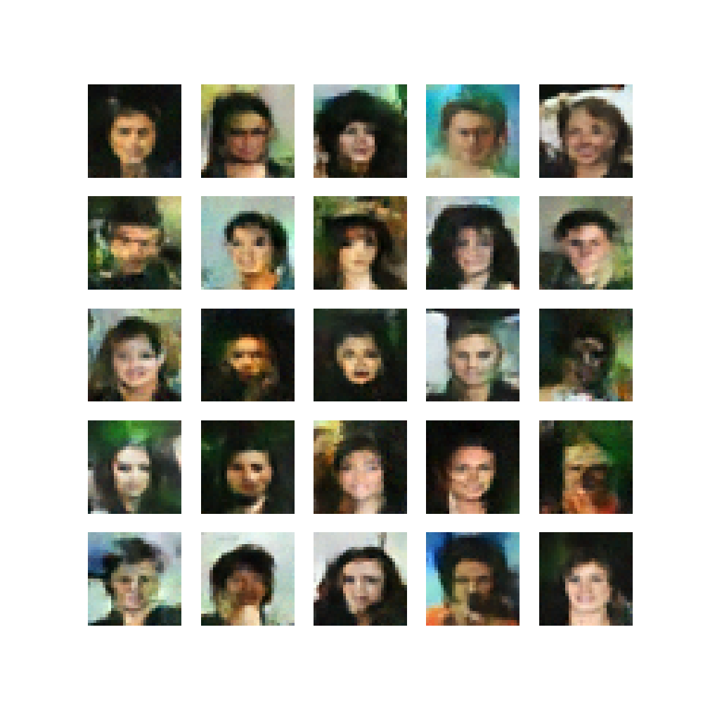
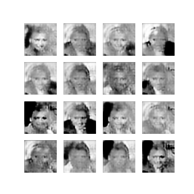

# Celeb_Face_Generator

> About

- Celebrity face generators built with Generative Adversarial Network and U-Net Diffusion Model using TensorFlow.

> U-Net Examples  

> GAN Examples

> Generative Adversarial Network

- I first attempted to build the generator using GAN. However, I found that the model overfits too quickly on the 10k image dataset.
- Generates 176x176 Gray-Scale images.
- Trained on 10k images, ran for 750 epochs.

> U-Net Diffusion Model

- The U-Net Diffusion Model was much more successful in generating accurate images. One issue would be that larger images tend to exponentially increase the required RAM and time to train the model.
- Generates 32x32 RGB images.
- Trained on 10k images, ran for 2 epochs with 5k iterations of randomly selected images.

You can find the .h5 file for the U-Net diffusion model here: [celeb_face_generator_diffusion_v1_epochs_2.h5](https://drive.google.com/file/d/1ubz4rtj6XkqgTHrPVi-fN2HCNiKyKKMy/view?usp=sharing)
